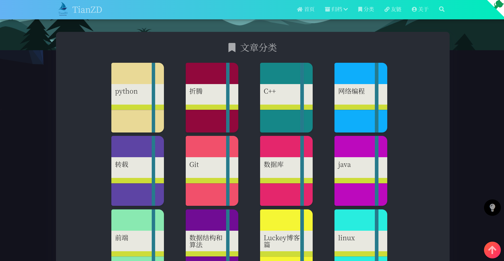

在Lucky的博客的基础上进行了简单的修改，基本上采用Lucky的模板

## 展示
[TianZD的主页](www.tianzd.cn)



demo:www.tianzd.cn

## 使用
### 安装nodejs
### 安装hexo

### 克隆仓库代码
```bash
git clone git@github.com:tianzhendong/hexo_blog.git
```
### 安装组件
```bash
npm i
```
### 本地预览
```bash
hexo s -g
```

具体搭建过程见Lucky的github仓库：[LuckyZmj/LuckyBlog: 基于Hexo+Matery的LuckyBlog开源博客搭建教程，演示站点：www.luckyzmj.cn (github.com)](https://github.com/LuckyZmj/LuckyBlog)
