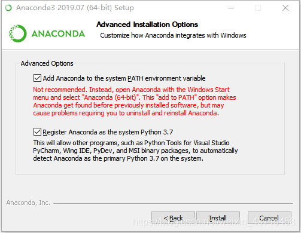
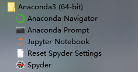
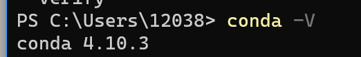

# Anaconda


## 介绍

Anaconda指的是一个开源的Python发行版本，其包含了conda、Python等180多个科学包及其依赖项。 因为包含了大量的科学包，Anaconda 的下载文件比较大（约 531 MB），如果只需要某些包，或者需要节省带宽或存储空间，也可以使用Miniconda这个较小的发行版（仅包含conda和 Python）。

Conda是一个开源的包、环境管理器，可以用于在同一个机器上安装不同版本的软件包及其依赖，并能够在不同的环境之间切换

Anaconda包括Conda、Python以及一大堆安装好的工具包，比如：numpy、pandas等

Miniconda包括Conda、Python

[清华Anaconda 镜像使用帮助](https://mirror.tuna.tsinghua.edu.cn/help/anaconda/)

## 下载、安装

### 下载

[清华镜像]( https://mirrors.tuna.tsinghua.edu.cn/anaconda/archive/)

[官网](https://www.anaconda.com/download/)

### 安装

下载后一路NEXT



第一个选项是添加环境变量，默认是没有勾选的，请务必勾选上，如果这里不勾选，后续安装完成后想要自行添加环境变量会非常麻烦。勾选完后点击 Install 安装。如果忘了勾选可以卸载重装。

安装完成后在开始菜单会多出一个快捷方式，也就是Anaconda下的4个子程序：



其中Anaconda Prompt 就是我们的cmd

Anaconda Navigator是管理器，可以在里面通过图像化界面管理虚拟环境

键入`python --version` 回车，查看当前安装的python版本
我们也可以通过键入`python` 回车进入python解释器

安装完成后，在**终端**输入`conda -V`注意v为大写，可以查看conda版本



## 更改源

[清华Anaconda 镜像使用帮助](https://mirror.tuna.tsinghua.edu.cn/help/anaconda/)

各系统都可以通过修改用户目录下的 `.condarc` 文件

Windows 用户无法直接创建名为 `.condarc` 的文件，可先执行 `conda config --set show_channel_urls yes` 生成该文件之后再修改。

```bash
channels:
  - defaults
show_channel_urls: true
default_channels:
  - https://mirrors.tuna.tsinghua.edu.cn/anaconda/pkgs/main
  - https://mirrors.tuna.tsinghua.edu.cn/anaconda/pkgs/r
  - https://mirrors.tuna.tsinghua.edu.cn/anaconda/pkgs/msys2
custom_channels:
  conda-forge: https://mirrors.tuna.tsinghua.edu.cn/anaconda/cloud
  msys2: https://mirrors.tuna.tsinghua.edu.cn/anaconda/cloud
  bioconda: https://mirrors.tuna.tsinghua.edu.cn/anaconda/cloud
  menpo: https://mirrors.tuna.tsinghua.edu.cn/anaconda/cloud
  pytorch: https://mirrors.tuna.tsinghua.edu.cn/anaconda/cloud
  pytorch-lts: https://mirrors.tuna.tsinghua.edu.cn/anaconda/cloud
  simpleitk: https://mirrors.tuna.tsinghua.edu.cn/anaconda/cloud
```

即可添加 Anaconda Python 免费仓库。

运行 `conda clean -i` 清除索引缓存，保证用的是镜像站提供的索引。

运行 `conda create -n myenv numpy` 测试一下吧。

## 虚拟环境

[Anaconda创建、激活、退出、删除虚拟环境](https://blog.csdn.net/sizhi_xht/article/details/80964099?spm=1001.2101.3001.6650.6&utm_medium=distribute.pc_relevant.none-task-blog-2%7Edefault%7EBlogCommendFromBaidu%7ERate-6.pc_relevant_default&depth_1-utm_source=distribute.pc_relevant.none-task-blog-2%7Edefault%7EBlogCommendFromBaidu%7ERate-6.pc_relevant_default&utm_relevant_index=11)

方法1：通过Anaconda Navigator应用图形化方式管理，安装anaconda后自带

方法2：通过命令行

### 创建虚拟环境

使用 `conda create -n your_env_name python=X.X（2.7、3.6等）`

anaconda 命令创建python版本为X.X、名字为your_env_name的虚拟环境。your_env_name文件可以在Anaconda安装目录envs文件下找到。 指定python版本为2.7，注意至少需要指定python版本或者要安装的包， 在不指定python版本时，自动安装最新python版本。

```bash
conda create -n env_name python=2.7
# 同时安装必要的包
conda create -n env_name numpy matplotlib python=2.7
```

### 激活虚拟环境

使用如下命令即可激活创建的虚拟环境

Linux:  `source activate your_env_name(虚拟环境名称)`

Windows: `activate your_env_name(虚拟环境名称)`

### 退出虚拟环境

使用如下命令即可退出创建的虚拟环境

Linux: `source deactivate your_env_name(虚拟环境名称)`

Windows:`deactivate env_name`，也可以使用`activate root`切回root环境

### 虚拟环境管理

**删除环境：**

使用命令`conda remove -n your_env_name(虚拟环境名称) --all`， 即可删除。

**删除虚拟环境中的包：**

使用命令`conda remove --name $your_env_name $package_name（包名）` 即可。


## 常用命令

1. `conda list`：查看安装了哪些包。
2. `conda install package_name(包名)`：安装包
3. `conda env list 或 conda info -e`：查看当前存在哪些虚拟环境
4. `conda update conda`：检查更新当前conda


